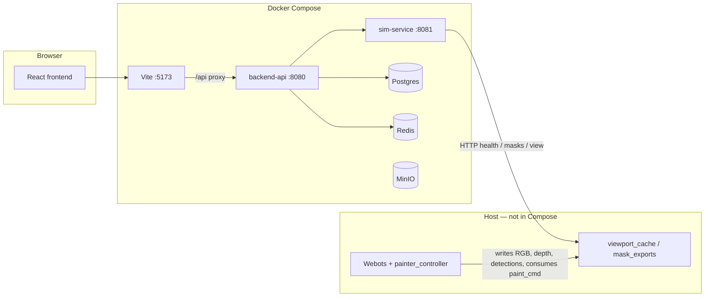

# PaintCell — Car Painting MVP

End-to-end lab stack: operators drive a **Webots** painting cell through a **React** UI, while a **FastAPI** backend records sessions and coordinates **YOLO** masks, operator-approved PNGs, and paint jobs. This README focuses on **what runs where**, **what each piece does**, and **how to start it**.

---

## Architecture (high level)



- **Frontend** talks to **backend-api** under `/api/v1`. It does not call **sim-service** directly in production-like setups; the backend proxies relevant `/sim/...` routes so one origin and CORS stay simple.
- **sim-service** exposes viewport images, mask upload/download, and runtime control endpoints. It reads/writes paths under the repo’s **`controllers/`** tree (bind-mounted in Docker) so **Webots** and the **sim-service** container share the same `viewport_cache` and `mask_exports` PNGs.
- **Webots** (`painter_controller`) runs on the host, performs perception and spray simulation, and exchanges data with the stack via files in `controllers/painter_controller/viewport_cache/` (see below).

---

## Infrastructure (`infra/docker-compose.yml`)

All services are defined in Compose; run everything from `infra/` (see [Run the stack](#run-the-stack)).

| Service | Port | Purpose |
|--------|------|---------|
| **postgres** | `5432` | Primary database: workcells, sessions, captures, detections, mask revisions, paint jobs. Credentials default to `paint` / `paint`, database `paintdb`. |
| **redis** | `6379` | Caching and pub/sub-style plumbing for the backend and sim adapter (event streams / coordination). |
| **minio** | `9000` (S3 API), `9001` (console) | S3-compatible object storage for artifact URIs (e.g. captures/masks referenced as `s3://...` in tests or future pipelines). Default login `minioadmin` / `minioadmin`. |
| **backend-api** | `8080` | **Main API**: REST under `/api/v1` (sessions, captures, detections, masks, paint-jobs, WebSocket events). Proxies **sim** routes to **sim-service** (`SIM_SERVICE_URL`). Waits for Postgres healthy and **sim-service** healthy before traffic is assumed ready. |
| **sim-service** | `8081` | **Simulation adapter**: health check, viewport `latest.jpg`, MJPEG stream, runtime start/stop/capture/detect, **mask PNG upload** and **GET by filename**, and writing **paint commands** for Webots. Mounts **`../controllers`** and **`../worlds`** into `/workspace/...` so mask files and assets align with the repo layout. |
| **frontend** | `5173` | **Operator UI** (Vite). Set `VITE_PROXY_TARGET` to the backend container so browser requests to `/api` are forwarded to **backend-api**. |

**Volumes:** named volumes persist Postgres and MinIO data across restarts. **sim-service** bind-mounts your working tree so `mask_exports/*.png` written by upload or by Webots stay visible to both.

---

## Repository layout (quick reference)

| Path | Role |
|------|------|
| `services/backend-api` | FastAPI app, SQLAlchemy models, Alembic optional migrations, REST + WS. |
| `services/sim-service` | FastAPI wrapper around viewport files and paint dispatch to Webots. |
| `services/frontend` | React + Vite operator workbench (session → inspection → mask approval → production → operations). |
| `shared/contracts` | Shared JSON Schema for event envelopes (e.g. websocket payloads). |
| `infra/docker-compose.yml` | Local full stack (database, cache, storage, API, sim, UI). |
| `worlds/` | Webots world files (e.g. `painter.wbt`). |
| `controllers/painter_controller/` | Webots controller: YOLO, viewport feed, **`viewport_cache/`** (RGB/depth/meta, **`mask_exports/`** PNGs), paint execution. |
| `scripts/smoke_e2e.sh` | API-only smoke test against a running backend (no Webots required). |

---

## Webots and `viewport_cache` (runs on the host)

Docker does **not** start Webots. For a live cell you run Webots with the painter world and controller on your machine.

- **`viewport_cache`** (under `controllers/painter_controller/viewport_cache/`) holds numpy/image artifacts and JSON the UI and sim-service rely on (e.g. `rgb.npy`, depth, detections, **`mask_exports/*.png`**).
- Operator-edited masks uploaded through the UI land in **`mask_exports`** via **sim-service**; the painter prefers those PNG paths when executing an approved paint job.
- If paths differ on your machine, set **`PAINTCELL_WORKSPACE`** to the **repository root** that contains `controllers/` so both Webots and tools resolve the same workspace.

---

## Run the stack

### Prerequisites

- **Docker** with Compose v2.

### Start everything

From the **repository root**:

```bash
cd infra
docker compose up --build
```

Leave this running. First boot waits for Postgres and **sim-service** healthchecks.

### URLs (defaults)

| What | URL |
|------|-----|
| Operator UI | http://localhost:5173 |
| Backend API | http://localhost:8080 — docs at `/docs`, health at `/health` |
| API prefix | http://localhost:8080/api/v1 |
| Sim service (direct) | http://localhost:8081 — health typically at `/health` |
| Postgres | `localhost:5432` |
| Redis | `localhost:6379` |
| MinIO S3 API | http://localhost:9000 |
| MinIO console | http://localhost:9001 |

### Frontend development without rebuilding the UI container

You can run Vite on the host while Compose runs the API and sim:

```bash
cd services/frontend
npm install   # once
npm run dev
```

Point `VITE_PROXY_TARGET` at `http://localhost:8080` (or rely on defaults that proxy `/api` to the backend). Open the URL Vite prints (usually port `5173`).

---

## Smoke test (API contract)

With **backend-api** up (Compose or local):

```bash
./scripts/smoke_e2e.sh
```

Optional: `API_BASE=http://localhost:8080/api/v1 ./scripts/smoke_e2e.sh`

This walks a minimal **session → capture → detection → mask revision → paint job → execute → close** flow using placeholder artifact URIs. It validates the HTTP API only; it does not start Webots or verify viewport files.

---

## Operator UI design references

Static PNG references for the flow (session, live camera, mask edit, paint, history) live under `services/frontend/design/` for design alignment.

---

## Troubleshooting (short)

- **503 / sim unreachable from backend:** Ensure **sim-service** is healthy (`docker compose ps`) and port `8081` is free.
- **Empty viewport / mask 404:** Confirm Webots is running with the viewport feed and that **`controllers/painter_controller/viewport_cache`** is populated; **sim-service** must see the same bind-mounted `controllers` path as your repo.
- **CORS in the browser:** The backend allows local and typical LAN origins; use the Vite dev proxy or open the UI on `localhost`/`127.0.0.1` as configured.
